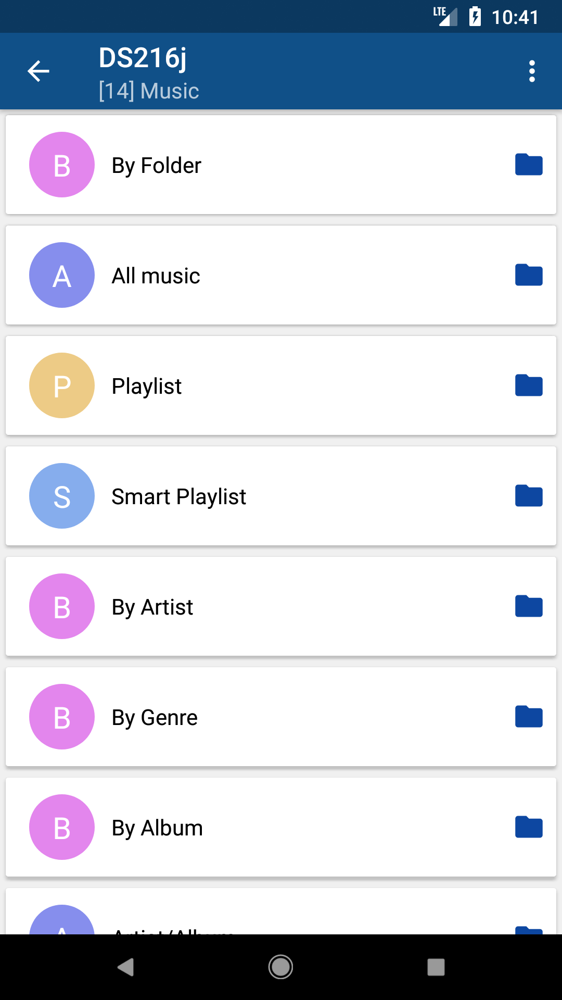
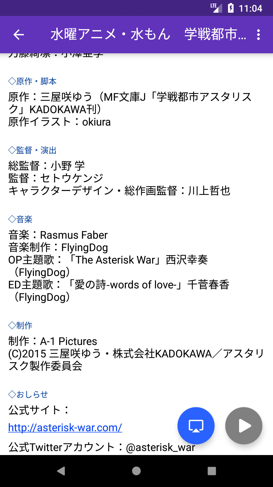
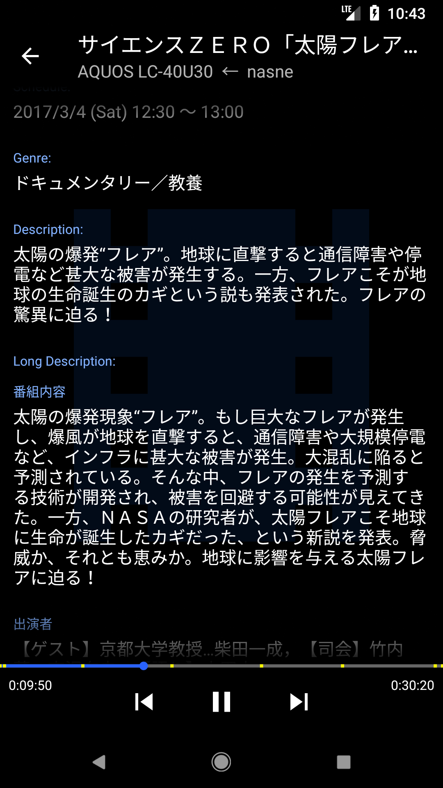
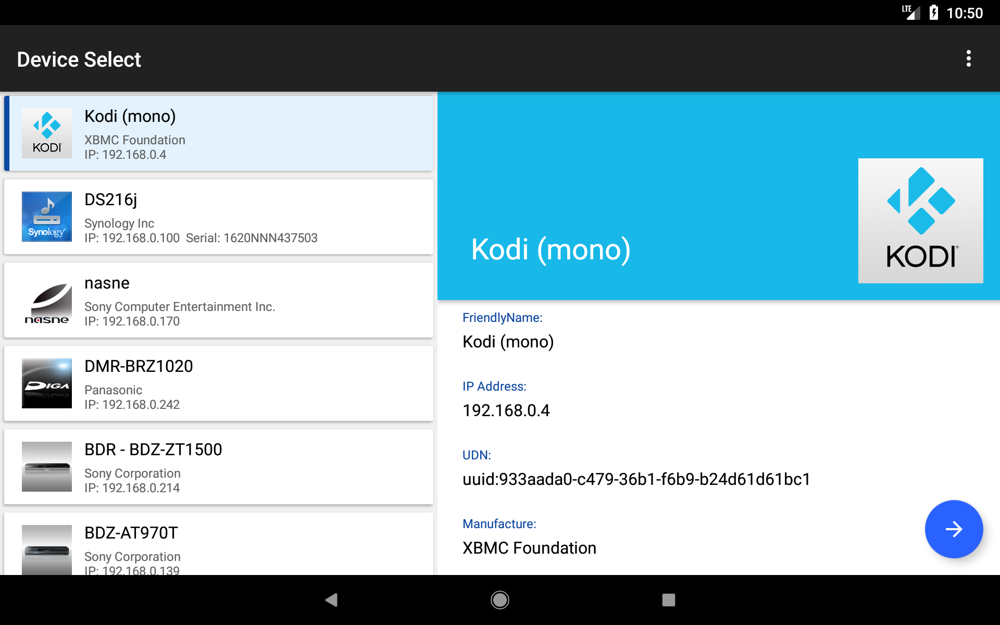
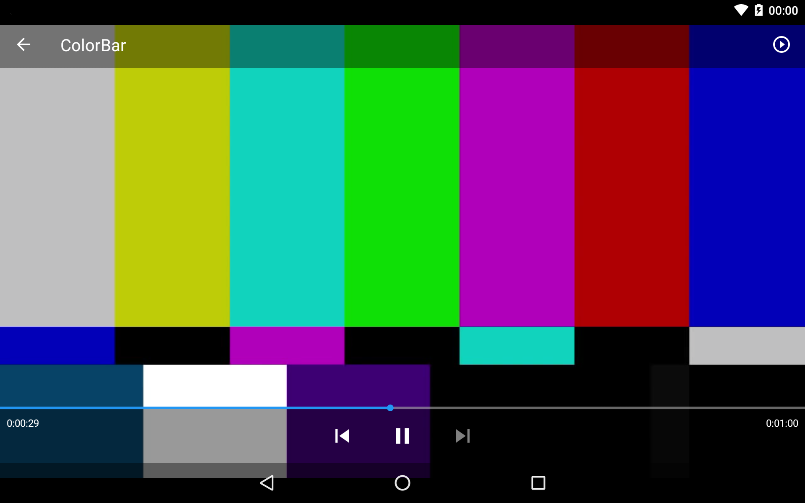

# DMS Explorer
[](./LICENSE)
[](https://github.com/ohmae/DmsExplorer/releases)
[](https://github.com/ohmae/DmsExplorer/issues)
[](https://github.com/ohmae/DmsExplorer/issues)
[](https://travis-ci.org/ohmae/DmsExplorer)
[](https://codecov.io/gh/ohmae/DmsExplorer)

This is a DLNA player featuring displaying server and content metadata.
DMC function is also implemented and can be make play back to DMR.
Source code is published under the Open source license (MIT license).

This app's feature is to information display about DLNA server (DMS) and its contents.
Since the playback function uses the codec of the device, which file can be played depends on the device.
For example, in the case of movies,
if it is a format compliant with the Android standard such as H.264 / VP8 / VP9, it seems playable on almost all devices.
Some devices may be able to play MPEG 1 / MPEG 2 / WMV / DivX, etc.
If you can not play it, you can launch the external application in settings so please try it.

As one of the playback methods, the DMC function is implemented.
If you have a TV with DMR function on the same network, you can make DMS contents play back to DMR.
If the DMR supports it, DTCP-IP content playback is also possible.
Also, if you have a SONY recorder such as nasne, or Panasonic recorder, you can use chapter jump function.

Although it carries the minimum playback function of movies, still images and music,
it features a metadata display function of server and contents rather than usability as a player.
Since information on ARIB extension tag (arib:longDescription, etc) is also displayed,
detailed program information can be seen if recorder etc is compatible.
Also, if the program information contains a URL, it will automatically act as a link.

## Screenshots

||||
|-|-|-|
||||

|||
|-|-|

## Install
<a href='https://play.google.com/store/apps/details?id=net.mm2d.dmsexplorer'></a>

### Repository by contributors
[IzzyOnDroid](https://apt.izzysoft.de/fdroid/index/apk/net.mm2d.dmsexplorer)

## Build
```
gradlew assembleRelease
```
And this project can open as Android Studio project.

## Remarks
This is an application example of [mmupnp](https://github.com/ohmae/mmupnp).

## Author
大前 良介 (OHMAE Ryosuke)
http://www.mm2d.net/

## License
[MIT License](./LICENSE)
